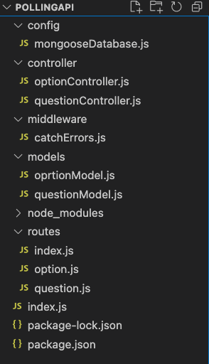

# Polling-API
Polling API is a RESTful API built using Node.js, Express and mongoDB as database that allows users to create and manage polls. The API provides endpoints to create a new question, get a question, delete a question, create a new option, add vote to the option and delete a option.
Note:- A question cannot be deleted if one of it’s option has one or more then one votes.
An option cannot be deleted if it has one or more votes
***

###Demo:- https://pollingapi-ybwf.onrender.com

## Project Structure 



## Install and Run on local system
```
$ git clone https://github.com/amitmungare/polling-api.git
$ cd polling-api
$ npm i
```
## Run the project
```
$ npm start
```

## Run API's in postman (localhost)

* Create Question :-
``` localhost:8000/api/v1/questions/create ```
* Create Option :-
``` localhost:8000/api/v1/questions/:id/options/create ```
* View Question :-
``` localhost:8000/api/v1/questions/:id ```
* Delete Option :-
``` localhost:8000/api/v1/options/:id/delete ```
* Delete Question :-
``` localhost:8000/api/v1/questions/:id/delete ```
* Add Vote :-
``` localhost:8000/api/v1/options/:id/add_vote ```
## Run Hosted API's
* Create Question :-
``` https://pollingapi-ybwf.onrender.com/api/v1/questions/create ```
* Create Option :-
``` https://pollingapi-ybwf.onrender.com/api/v1/questions/:id/options/create ```
* View Question :-
``` https://pollingapi-ybwf.onrender.com/api/v1/questions/:id ```
* Delete Option :-
``` https://pollingapi-ybwf.onrender.com/api/v1/options/:id/delete ```
* Delete Question :-
``` https://pollingapi-ybwf.onrender.com/api/v1/questions/:id/delete ```
* Add Vote :-
``` https://pollingapi-ybwf.onrender.com/api/v1/options/:id/add_vote ```
